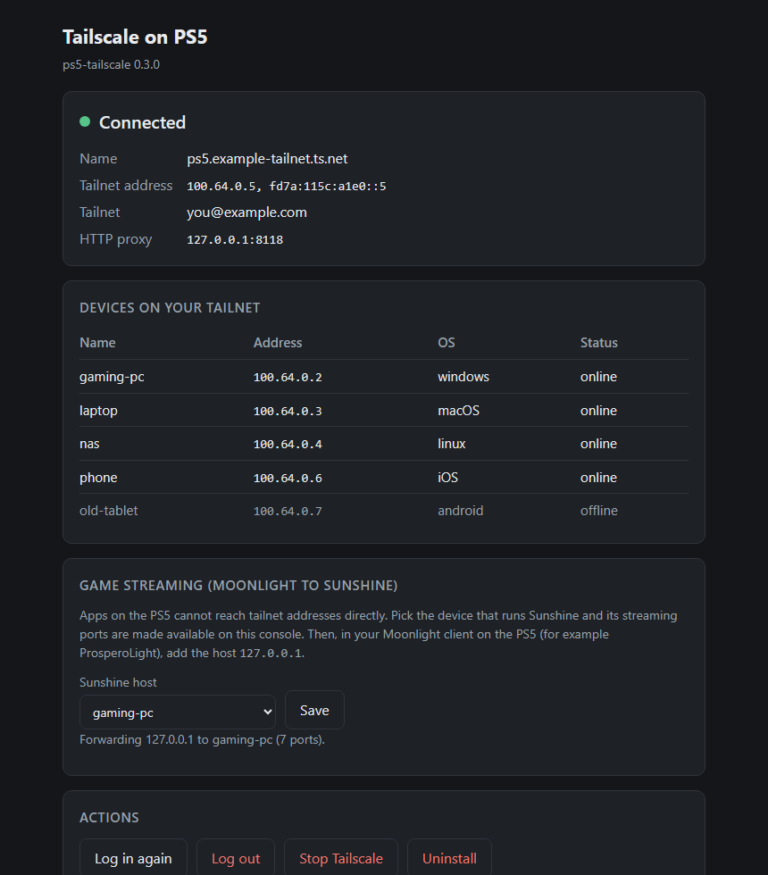

# Tailscale for jailbroken PS5

Puts a jailbroken PS5 on your [Tailscale](https://tailscale.com) network.

- **Reach the console from anywhere.** FTP, the payload loader, web tools:
  whatever listens on the console is available at its tailnet address from
  your other Tailscale devices.
- **Remote Play over Tailscale.** Play the PS5 from anywhere with a Remote
  Play client, at the console's tailnet address, with no port forwarding on
  your router.
- **Stream games to the console over Tailscale.** A Moonlight client on the
  PS5 (such as ProsperoLight) can connect to a Sunshine host on your tailnet.
- **Home screen icon** that opens its status page.

It runs the real Tailscale client code (v1.104.0) as a single payload.



> **Unofficial and experimental.** This project is not affiliated with or
> endorsed by Tailscale Inc. or Sony. It has been tested on one console. It
> runs homebrew with full privileges on a jailbroken system; use it at your
> own risk.

## What it is not

The PS5 kernel has no tunnel device, so Tailscale cannot become a system-wide
VPN here. It runs inside one process:

- Games and PSN traffic do **not** go through Tailscale.
- Other apps on the console cannot open connections to tailnet addresses
  directly. They can through a *local forward* (see
  [game streaming](#game-streaming-moonlight-to-sunshine) and
  [configuration](#configuration)).
- No subnet routing, Tailscale SSH, Taildrop or Funnel.
- The console cannot use an exit node, and it does not offer itself as one.
  Offering one is doable (it needs no tunnel device), but the PS5 would make
  a terrible exit node: every packet would pass through this one low-priority
  process, so it would be slow, and it would fall away whenever the console
  goes into rest mode, reboots or loses its jailbreak, taking the internet of
  every device using it with it. Use a PC, a server or a router on your
  tailnet instead.

## Requirements

- A jailbroken PS5 with an ELF loader listening on port 9021
  (for example [elfldr](https://github.com/ps5-payload-dev/elfldr)).
- A Tailscale account.

Tested on firmware 13.42 with elfldr 0.26.

## Install

There is one file, `tailscale.elf`, and it is an ordinary payload: running
it starts Tailscale.

1. Download `tailscale.elf` from the [latest release](../../releases/latest).
2. Send it to the console's ELF loader. Any payload sender works:

   ```bash
   # Linux / macOS
   socat -t 60 - TCP:<console-ip>:9021 < tailscale.elf
   ```

   ```powershell
   # Windows (script from this repository)
   .\tools\ps5send.ps1 -File tailscale.elf -PS5Host <console-ip>
   ```

3. Open `http://<console-ip>:8090` on a phone or PC. Scan the QR code or
   follow the link and log in to Tailscale. If your tailnet uses device
   approval, approve the console in the admin console.

The console now has a tailnet address, shown on the status page. The first
run also adds a **Tailscale** icon to the home screen (media section) that
opens the status page.

Tailscale runs until the console restarts. After a restart and jailbreak,
send `tailscale.elf` again; the login and settings are kept. If you use a
payload manager or autoloader, add the file there like any other payload.

To update, use the new `tailscale.elf` in place of the old one. Sending it
while Tailscale is running replaces the running copy.

## Using it

### Reaching the console

Connect to the console's tailnet address or MagicDNS name on the port you
want, for example FTP on 2121 or the payload loader on 9021.

- Every TCP port that something on the console listens on is forwarded.
  Ports with no listener refuse the connection.
- UDP ports have to be listed, under **Settings** on the status page. The
  default list is Remote Play's.
- To keep a TCP port off the tailnet, list it under "TCP ports never
  exposed" in the settings.

### Remote Play

The console's own Remote Play service is reachable at its tailnet address, so
a Remote Play client on any of your Tailscale devices can connect from
anywhere. Any client that lets you enter the console's address works.

1. On the console, enable Remote Play (Settings > System > Remote Play).
2. Register your Remote Play client with the console as usual. This is
   easiest at home on the same network; see the client's documentation.
3. In the client, add the console manually with its **tailnet address**
   (shown on the status page).
4. Connect.

Tested and working with Chiaki, and with Asobi on iOS and Android.

How it works: Remote Play uses TCP 9295 and UDP 9295, 9296, 9297 and 9302.
The TCP port is forwarded like any other; the daemon listens on the UDP
ports on the console's tailnet addresses and relays them to the service.

Notes:

- The video passes through the daemon, which by default runs at the lowest
  priority so that it never takes time from a game. If the stream stutters
  under a demanding game, set **Priority** to High in the settings and start
  Tailscale again.
- Waking the console from rest mode does not work: nothing runs while it
  sleeps, so it is not on the tailnet then. Tailscale carries on by itself
  once the console is awake again.

### The status page

`http://<console address>:8090`, on the LAN or over the tailnet, or the
**Tailscale** icon on the home screen. It shows the connection state, the
login link and your devices, and has the game streaming hosts, the settings,
and buttons for logging out, stopping and uninstalling. It also says when a
newer release is available.

**Devices.** The list is grouped into your tailnet's devices and devices
shared with you, and marks the ones that can be used as an exit node. It can
be searched (name, address, OS, tag, place) and limited to devices that are
online. If your tailnet has a VPN add-on such as Mullvad, its exit servers
are counted but kept out of the list until you tick **Show VPN exit
servers**. Click an address to copy it.

**Key expiry.** The page shows when the console's Tailscale key expires. By
default that is 180 days after logging in, and an expired key takes the
console off your tailnet until someone presses **Log in again**. From two
weeks before, the page and a notification on the console warn about it. To
avoid it altogether, open the Tailscale admin console, find the console in
the list of machines and choose **Disable key expiry**.

**Password.** Out of the box the page has no password, like the console's
other homebrew services: anyone on your LAN, or on your tailnet if your ACLs
allow it, can use it. Set one under **Settings**. It is then asked for on
every device except the console itself. If you forget it, delete the
`passwordHash` line from `/data/tailscale/config.json`.

**Settings.** The name on the tailnet, the password, who on the tailnet may
connect, which UDP ports are reachable and which TCP ports are not, extra
forwards, the HTTP proxy, the priority, and update checks. Most take effect when saved; the page says which
ones need Tailscale to be started again.

### Game streaming (Moonlight to Sunshine)

This lets a Moonlight client on the PS5 stream from a PC that is somewhere
else, over Tailscale.

On the PC:

1. Install [Sunshine](https://github.com/LizardByte/Sunshine).
2. Install Tailscale and log in to the same tailnet as the console.

On the console:

1. Open the status page and find **Game streaming**.
2. Press **Add a host**, enter the device that runs Sunshine and press
   **Save**. The page then shows what to enter in Moonlight.
3. In your Moonlight client on the PS5, add a host manually with the address
   **`127.0.0.1`**. Do not enter the PC's tailnet address: the client cannot
   reach it.
4. Pair as usual: the client shows a PIN, which you enter in Sunshine's web
   interface on the PC.

How it works: the daemon listens on `127.0.0.1` on Sunshine's ports (by
default TCP 47984, 47989, 48010 and UDP 47998, 47999, 48000, 48002) and
relays them to the host through Tailscale. To the Moonlight client the
Sunshine host appears to be the console itself.

More than one host, or a host that does not use the default port:

- If a host's Sunshine is set to another port (Sunshine's "Port" setting),
  enter that port next to the host. In Moonlight, add `127.0.0.1:<port>`.
- Several hosts can be forwarded at once, but they all appear on
  `127.0.0.1`, so each needs its own port: give every host a different port
  in Sunshine, at least 30 apart (for example 47989 and 48989).

Notes:

- A wired connection on the console helps, as with any streaming.
- **Do not change the console's network (Wi-Fi to Ethernet, connection
  settings) while a stream is running.** That froze the test console once;
  the cause was not established.
- Tested with ProsperoLight.

### Other apps on the console

"Extra forwards" in the settings relay any localhost port to a tailnet host
in the same way, TCP or UDP. One per line, for example
`tcp 127.0.0.1:8096 my-nas:8096`.

The daemon can also run an HTTP proxy that reaches tailnet hosts, for apps
that have their own proxy setting. It is off unless you give it an address in
the settings (for example `127.0.0.1:8118`). **Do not set it as the PS5's
system proxy.** The system then sends everything through it, including pages
on `127.0.0.1`, and it is not running until Tailscale has been loaded. On the
test console that stopped another homebrew tool's page from opening.

## Configuration

Use **Settings** on the status page. The settings are stored in
`/data/tailscale/config.json`, which can also be edited by hand; start
Tailscale again (send the payload) to apply hand edits. Every field is
optional.

```json
{
  "hostname": "ps5",
  "authKey": "",
  "webAddr": ":8090",
  "passwordHash": "",
  "httpProxyAddr": "",
  "controlURL": "",
  "sunshineHosts": [
    {"host": "gaming-pc"},
    {"host": "office-pc", "port": 48989}
  ],
  "forwards": [
    {"proto": "tcp", "listen": "127.0.0.1:8096", "target": "my-nas:8096"}
  ],
  "udpPorts": [9295, 9296, 9297, 9302],
  "blockedPorts": [],
  "allowFrom": "",
  "priority": "",
  "checkUpdates": true,
  "verbose": false
}
```

| Field | Meaning |
| --- | --- |
| `hostname` | The console's name on the tailnet. |
| `authKey` | A Tailscale auth key, to log in without the browser step. File only. |
| `webAddr` | Where the status page listens. |
| `passwordHash` | The status page's password, hashed. Set it on the status page; delete the field to remove a forgotten password. |
| `httpProxyAddr` | Where the HTTP proxy listens. Empty, the default, is off. |
| `controlURL` | A coordination server other than Tailscale's. File only. |
| `sunshineHosts` | The Sunshine hosts and, where it is not 47989, their port. |
| `forwards` | Extra local forwards: `proto` is `tcp` or `udp`, `listen` a localhost address, `target` a tailnet host and port. |
| `udpPorts` | The console's UDP ports reachable from the tailnet. Default `[9295, 9296, 9297, 9302]` (Remote Play). `[]` turns inbound UDP off. |
| `blockedPorts` | Local TCP ports that are never exposed to the tailnet. |
| `allowFrom` | `"own"` lets only devices logged in as the same user as the console connect; other users' devices and devices shared into the tailnet are turned away. Anything else is the default: every device your tailnet's access rules allow. If the console is tagged, `"own"` means the devices of its own tailnet. |
| `priority` | `"high"` lets the daemon compete with games for CPU time; anything else is the default, low. Applied when Tailscale starts. |
| `checkUpdates` | Ask GitHub twice a day whether a newer release exists, to show it on the status page and announce it once on the console. Nothing is downloaded. |
| `verbose` | Put Tailscale's own log in the main log as well. |

Files on the console:

| Path | What |
| --- | --- |
| `/data/tailscale/config.json` | Settings. |
| `/data/tailscale/state/` | Tailscale's state, including the login. |
| `/data/tailscale/tailscale.log` | The daemon's log, rotated at 2 MB. |
| `/data/tailscale/tailscale-debug.log` | Tailscale's detailed log, up to 4 MB plus one older file. |
| `/data/tailscale/launcher.log` | What the payload did before Tailscale itself started. The place to look when nothing seems to happen. |
| `/data/tailscale/icon-installed` | Marks that the home screen icon was added. Delete it to have the icon added again on the next start. |
| `/data/tailscale/icon-helper.elf` | The small payload that adds and removes the icon. |
| `/user/app/TSCL00001/` | The home screen icon. |

## Uninstall

Press **Uninstall** on the status page. It removes the home screen icon, logs
the console out of your tailnet, deletes `/data/tailscale` (login, settings,
logs) and stops Tailscale.

Left to do by hand:

- Remove the device in the Tailscale admin console.
- If you added `tailscale.elf` to a payload manager or autoloader, remove it
  there, or it starts again on the next boot.

## Troubleshooting

- **Nothing happens when the payload is sent.** If the payload cannot start,
  it says why in a notification on the console and in
  `/data/tailscale/launcher.log`; fetch that file over FTP. A payload manager
  does not show what a payload prints, so sending it from a PC shows more:
  `socat -t 30 - TCP:<console>:9021 < tailscale.elf`, or
  `.\tools\ps5send.ps1 -File tailscale.elf -PS5Host <console>` on Windows.
  If the log ends with "starting the Go program" and no status page appears,
  whatever follows that line is the crash report to send.
- **The status page does not open on the console, but does from a PC.**
  Check that the PS5's proxy server setting is "Do Not Use".
- **The Moonlight client cannot find the host.** The host to add is
  `127.0.0.1` (or `127.0.0.1:<port>` for a host on another port), and the
  Sunshine host must be listed on the status page with the port its Sunshine
  uses.
- **"Not logged in" after logging in.** Press **Log in again** for a fresh
  link.
- **Forgot the status page password.** Delete the `passwordHash` line from
  `/data/tailscale/config.json` and start Tailscale again, or use the page on
  the console itself, where no password is asked.
- **Something else.** `http://<console>:8090/api/logs?full=1` is the daemon's
  log and `/api/logs?debug=1` is Tailscale's detailed log. Please attach them
  to bug reports, after checking them for anything you consider private.

## Security

- The status page and its controls have no password until you set one. With
  a password, only the console itself gets in without it. The page is served
  over plain HTTP: on the LAN the password travels unencrypted, over the
  tailnet Tailscale encrypts it.
- All listening TCP ports on the console, and the UDP ports in `udpPorts`,
  become reachable from your tailnet. That includes the payload loader, which
  runs anything sent to it. If other people use your tailnet or share
  devices into it, set **Who on the tailnet may connect** to your own devices
  only, use Tailscale ACLs, or list ports under "TCP ports never exposed".
- The local forwards and the proxy are for the console's own apps and are
  not exposed to the tailnet.
- With update checks on, the console contacts `api.github.com` twice a day.

## Resource use

About 60 MB of memory and next to no CPU when idle. By default the daemon
runs at the lowest scheduling priority on at most 4 cores, so it gives way to
games. With the priority set to High it shares those cores with games on
equal terms.

## What has and has not been tested

Tested on the one console: first run and upgrade, login with device approval,
starting again after a reboot with the saved login, reaching the console over
the tailnet, a ProsperoLight stream from a Sunshine host through the forward,
two forwarded hosts on different ports (with a stand-in for the second), the
HTTP proxy, adding and removing the home screen icon, the password from the
LAN and the tailnet, changing settings from the page, both priority settings,
the update check, limiting connections to your own devices (with the
console's owner's devices only; a refusal has not been seen for real), a
short stay in rest mode (about a minute: the same process
carried on and was back on the tailnet within a second of waking).

Remote Play through the tailnet address works with Chiaki and with Asobi on
iOS and Android.

Not tested: hours in rest mode, switching between Wi-Fi and Ethernet while
running, the complete Uninstall
on a console (its parts were tested separately), whether High priority
improves Remote Play, a real Sunshine host on a non-default port, other
firmware versions, coordination servers other than Tailscale's.

## Building

See [docs/BUILDING.md](docs/BUILDING.md). The build runs on Windows with
PowerShell, clang, ps5-payload-sdk and a patched Go 1.27.1.

## How it works

`tailscale.elf` is a small C program built with
[ps5-payload-sdk](https://github.com/ps5-payload-dev/sdk) with a Go program
embedded in it. The SDK's startup code lifts the PS5's restriction on where
system calls may be issued from. The C part drops the process to the lowest
scheduling priority, maps the Go program into memory and enters it the way
the FreeBSD kernel would. Go's runtime and standard library are patched to
speak the PS5's FreeBSD 9 era system call interface. The Go program is a
[tsnet](https://pkg.go.dev/tailscale.com/tsnet) server that pipes every
incoming tailnet TCP connection to the same port on localhost.

[docs/TECHNICAL.md](docs/TECHNICAL.md) has the details, including what was
learned about running Go on the PS5.

## Credits

- [Tailscale](https://github.com/tailscale/tailscale), whose client this runs.
- John Törnblom's [ps5-payload-sdk](https://github.com/ps5-payload-dev/sdk)
  and [elfldr](https://github.com/ps5-payload-dev/elfldr).
- itsPLK's [Payload Manager](https://github.com/itsPLK/ps5-payload-manager),
  whose app-icon installer this follows.

## License

The project's own code is licensed under the GNU General Public License
version 3 or later (see [LICENSE](LICENSE)); the payloads link the SDK's
GPL-licensed startup code. `patches/` is a patch to the Go source tree and is
under Go's BSD-style license. Tailscale is BSD-3-Clause. The release binaries
also contain Tailscale's dependencies under their own licenses; they are
listed in `tsd/go.mod`.

"Tailscale" is a trademark of Tailscale Inc. "PlayStation" and "PS5" are
trademarks of Sony Interactive Entertainment Inc.
